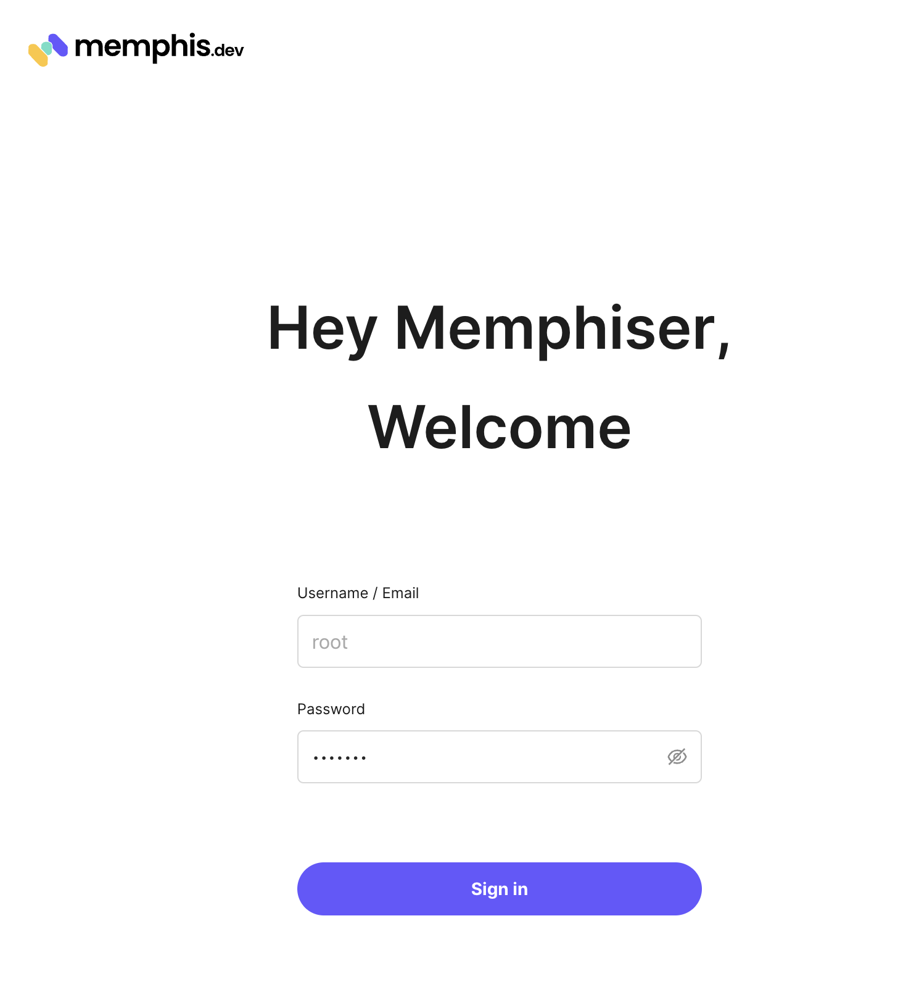
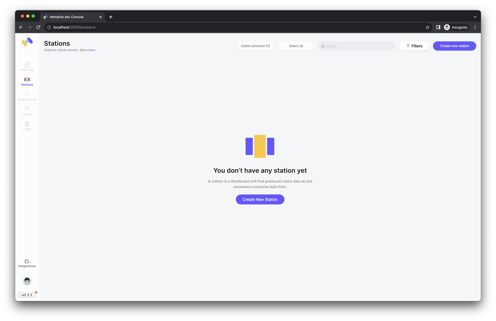
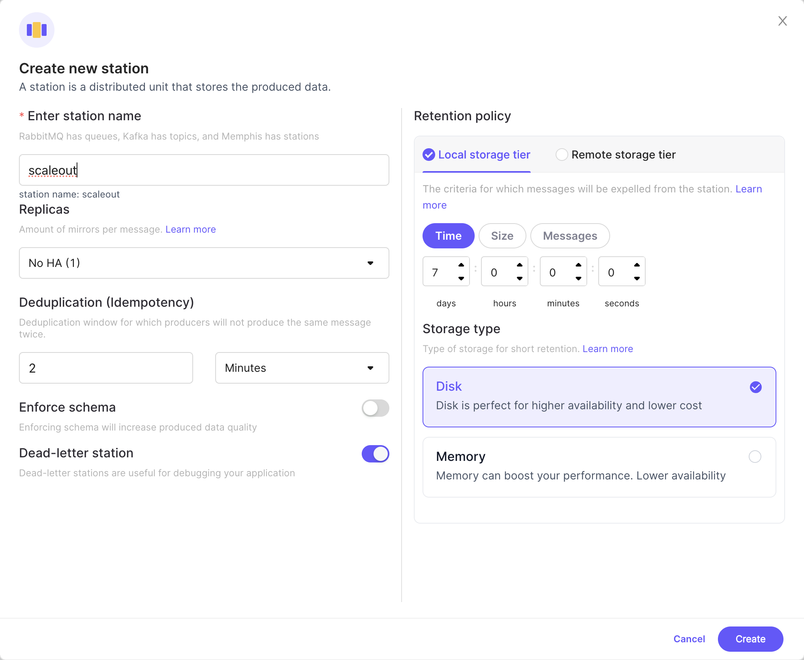
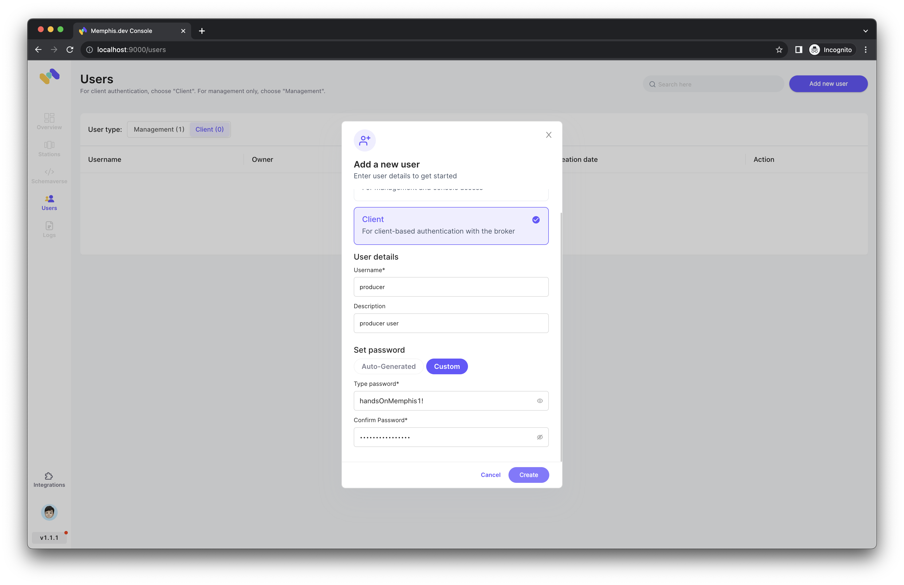
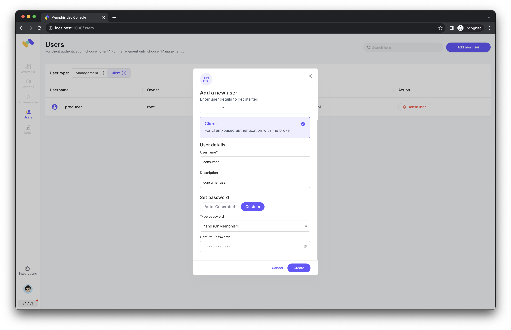
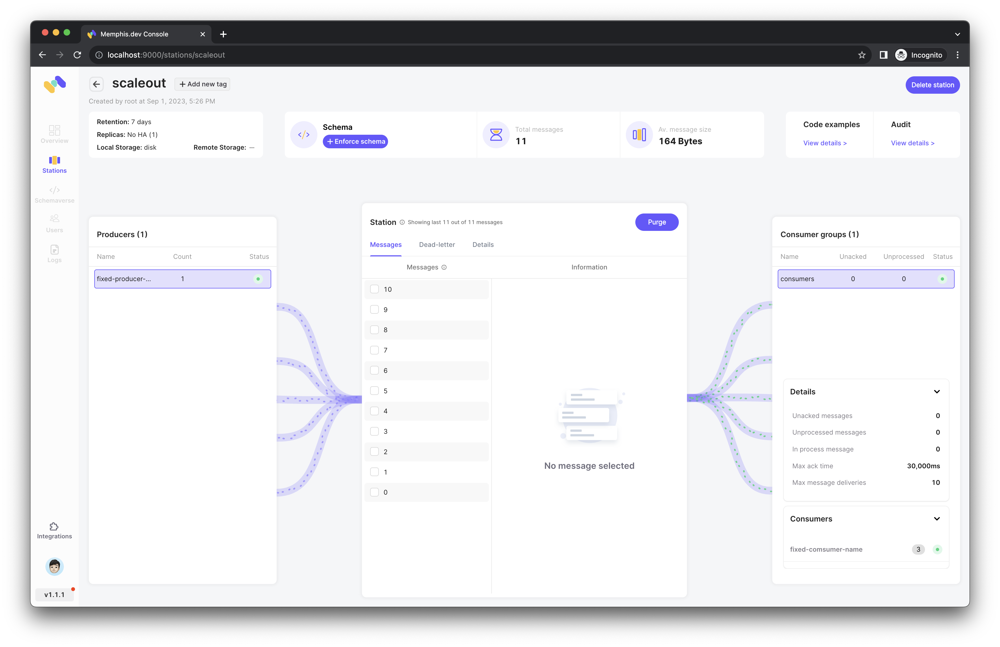
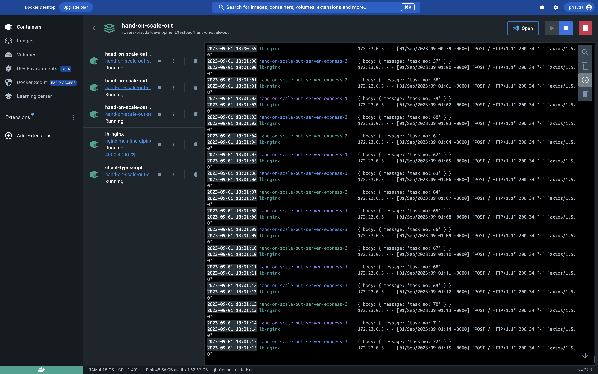

# Hands on: scaling-out application using docker-compose

---

# Goal
- scaling out application made by `node.js`
# Cases
## Message broker
- getting requests using message broker(`memphis`)
## HTTP server
- getting requests using HTTP request (`POST`) from node.js application made by `express` 

---

# Hands on

## Message broker
### Start the broker using docker-compose
```shell
docker compose -f docker-compose.broker.yaml up --build -d
```
### Create users via Web GUI
- access http://localhost:9000/login

- type `root` to username and `memphis` to password.


- create a new station, `scaleout`

- create a producer user, I set password as `handsOnMemphis1!`.

- then, create a consumer user, set same password.
### Description about producer and consumer as code level
```ts
// producer code
import { memphis } from 'memphis-dev';

const password: string = 'handsOnMemphis1!';
async function bootstrap() {
    const connection = await memphis.connect({
        host: 'memphis',
        username: 'producer',
        password,
    });
    try {
        const producer = await connection.producer({
            stationName: 'scaleout',
            producerName: 'fixed-producer-name',
        });
        const delay = (ms: number) => new Promise(resolve => setTimeout(resolve, ms));
        for (let i = 0; i <= 10; i++) {
            await producer.produce({
                message: Buffer.from(`${i}`),
            });
            await delay(1_000);
        }
    } catch (e) {
        if (connection) {
            await connection.close();
        }
    }
}

bootstrap();
```
- This is the producer code and you can see this in [app.ts](./message-producer/app.ts).
- It just send a message to broker from 0 to 9 with 1,000 ms latency for each request. 

```ts
// consumer code
import {
    memphis,
    Message
} from 'memphis-dev';

const password: string = 'handsOnMemphis1!';

async function bootstrap() {
    const connection = await memphis.connect({
        host: 'memphis',
        username: 'consumer',
        password
    });
    try {
        const consumer = await connection.consumer({
            stationName: 'scaleout',
            consumerName: 'fixed-comsumer-name',
            consumerGroup: 'consumers',
        });
        consumer.on("message", (message: Message) => {
            console.log(`fixed-comsumer-name got a message: ${Number(message.getData().toString())}`);
            message.ack()
        });
    } catch (e) {
        if (connection) {
            await connection.close();
        }
    }
}

bootstrap();
```
- As you can see [app.ts](./message-consumer/app.ts), it consume messages from producer using connection.
- The point is consumer group(`"consumers"`) and same consumer name (`"fixed-consumer-name"`)
- Message broker automatically balance the load for each consumers although their names are all same.
- 
### Start application (publisher and multiple subscribers)
```shell
docker compose -f docker-compose.pubsub.yaml up --build --scale message-consumer=3 -d
```
- This command scales out the consumer container into three using `--scale` option.

### Result
```shell
# logs of message-consumer-1 container
2023-09-01 17:43:02 fixed-comsumer-name got a message: 2
2023-09-01 17:43:03 fixed-comsumer-name got a message: 5
2023-09-01 17:43:04 fixed-comsumer-name got a message: 7
2023-09-01 17:43:05 fixed-comsumer-name got a message: 8
2023-09-01 17:43:06 fixed-comsumer-name got a message: 9
2023-09-01 17:43:07 fixed-comsumer-name got a message: 10
```
```shell
# logs of message-consumer-2 container
2023-09-01 17:43:02 fixed-comsumer-name got a message: 3
2023-09-01 17:43:03 fixed-comsumer-name got a message: 6
```
```shell
# logs of message-consumer-3 container
2023-09-01 17:43:01 fixed-comsumer-name got a message: 0
2023-09-01 17:43:01 fixed-comsumer-name got a message: 1
2023-09-01 17:43:02 fixed-comsumer-name got a message: 4
```

- The messages are distributed although the consumers names are same.
- Later, we figure out how it works.

```shell
docker compose -f docker-compose.pubsub.yaml -f docker-compose.broker.yaml down
```
- Then, stop all containers

## HTTP server
### Description about server and client as code level
```ts
// server code
import express from 'express';
import bodyParser from 'body-parser';
import {
    Request,
    Response,
} from "express";

const app = express();
app.use(bodyParser.json())

app.post('/', (req: Request, res: Response) => {
    const body = req.body
    console.log(body);
    res.send(body);
});

app.listen(3000);
```
- Simply it run express application and listen the port number, 3000
- But we are going to scale out this server, so configure `nginx` as load balancer

```nginx configuration
user nginx;
events {
    worker_connections 1024;
}
http {
    server {
        listen 4000;
        location / {
            proxy_pass http://server-express:3000;
        }
    }
}
```
- It listen port number 4000 and pass to the `http://server-express:3000`

```yaml
version: "3.9"

services:
  client-typescript:
    container_name: client-typescript
    hostname: client-typescript
    build:
      context: ./rest-client
      dockerfile: Dockerfile
    restart: always
    depends_on:
      - server-express
    networks:
      - req-res-scale-out-hands-on

  server-express:
    build:
      context: ./rest-server
      dockerfile: Dockerfile
    expose:
      - "3000"
    restart: always
    networks:
      - req-res-scale-out-hands-on

  lb-nginx:
    hostname: lb-nginx
    container_name: lb-nginx
    image: nginx:mainline-alpine3.18-slim
    depends_on:
      - server-express
    ports:
      - "4000:4000"
    volumes:
      - './nginx.conf:/etc/nginx/nginx.conf'
    networks:
      - req-res-scale-out-hands-on

networks:
  req-res-scale-out-hands-on:
    name: req-res-scale-out-hands-on
    driver: bridge
```
- For scaling out, do not notate `container_name` and `hostname` field to `server-express` container
- Just expose `3000` port

```ts
import axios from "axios";

const delay = (ms: number) => new Promise(resolve => setTimeout(resolve, ms));
const reqToServer = async () => {
    for (let i = 0; i < 100; i++) {
        await axios.post('http://lb-nginx:4000', {
            body: {
                message: `task no: ${i}`,
            }
        });
        await delay(1_000);
    }
};

reqToServer();
```
- Sending request to nginx, not the server container
- So the url is `"http://lb-nginx:4000"`

### Start application (client, load balancer, and multiple server)
```shell
docker compose -f docker-compose.reqres.yaml up --scale server-express=3 --build -d 
```

### Result

- The requests are also distributed well

---

# How it works?
## Message broker
- TBA
## Load balancer
- TBA